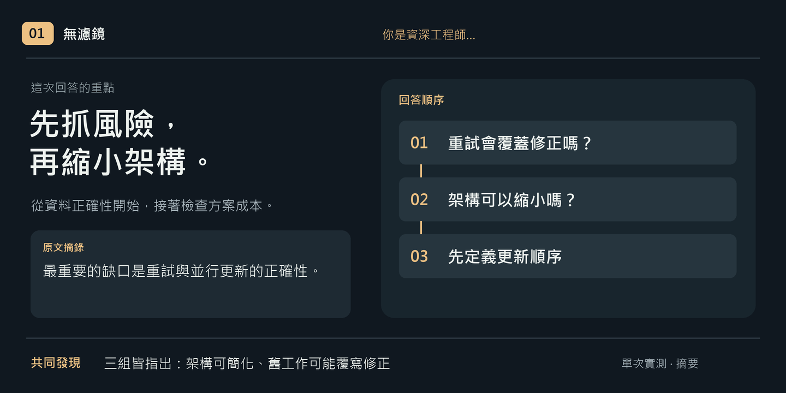
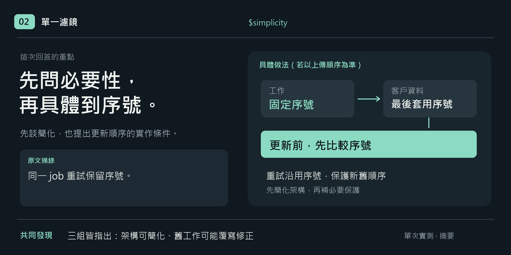
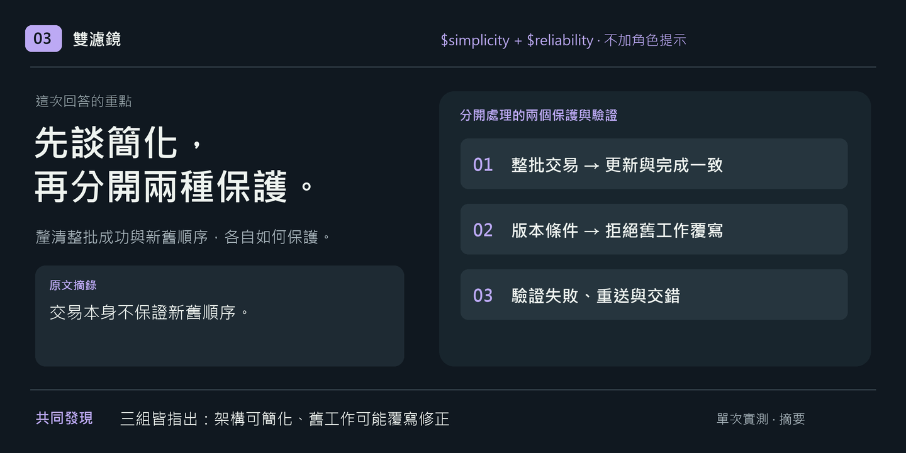

# masters-lenses

讓 Codex 帶著你關心的工程問題，再看一次目前的工作。六個 skill 各自聚焦不同面向，可用於討論、規劃、實作與檢討。

[取得 ZIP](dist/masters-lenses.zip)

## 先看一次實際對照

**同一份材料，換個關注面向，回答會差在哪？** 我們讓三個獨立 subagent 審查同一份 CSV 客戶匯入方案：目前只需 CSV，提案預留多格式架構，失敗會整批重試，也可能與修正後的匯入同時執行。

三組使用相同材料與問題：**角色組只加「你是資深工程師」，單濾鏡組只用 `$simplicity`，雙濾鏡組只用 `$simplicity` ＋ `$reliability`。** 兩個濾鏡組都不加資深工程師角色提示。下圖將單次實測整理成重點摘要，各附一句原文；完整回答見下方連結。







**這次三組都抓到了主要風險，也都提出驗證情境；雙濾鏡沒有多找到一個關鍵缺陷。** 角色組先談失敗風險，兩個濾鏡組先談架構簡化；單次結果不代表品質排名。你可以用濾鏡指定這次最想釐清的問題，不必追求更多濾鏡。

[查看相同材料與問題](examples/csv-import/input.md) · [查看三組提示詞、回答文字與測試限制](examples/csv-import/README.md)

## 第一次使用

安裝後，在已有的任務討論中輸入「`$濾鏡名稱` ＋ 你想檢查的問題」即可。例如，想檢查方案是否做得太複雜：

```text
$simplicity 請檢查目前方案：哪些部分是需求必要的，哪些可以省掉？先說明理由，不修改檔案。
```

先選一個你最在意的問題，不必一次用完六個濾鏡。回答重點是目前材料支持的取捨；沒有新觀察時，也可以直接說沒有。

**不知道選哪個？** 把這份 README 提供給 Codex，再問：

```text
我現在卡在＿＿，希望做到＿＿。請推薦一個適合的濾鏡，先說明理由。
```

## 按問題選擇

| 呼叫 | 你想釐清的問題 | 請求例子 | 何時不該用 |
|---|---|---|---|
| `$design` | 這個選擇會把成本帶到哪裡？ | 檢查這個設計會讓哪些後續工作變容易或變困難。 | 沒有具體系統、方案或待選擇的問題，只問「最佳架構是什麼」。 |
| `$feedback` | 下一步做什麼，才能知道方向對不對？ | 哪一步最能區分目前的兩個假設？何時足以停止？ | 已有足夠證據決定下一步，也不需要再檢查驗收方式，只剩執行。 |
| `$evolve` | 下次需求改變，要跟著改多少地方？ | 檢查哪些規則必須一起改、哪些應各自維護。 | 沒有可追蹤的結構或變更情境，只要求「永遠好擴充」。 |
| `$simplicity` | 有沒有做得太複雜？ | 檢查這些層次各自保護什麼行為，哪些可以省掉。 | 沒有具體方案、程式或流程可檢查，只要求「更簡單」。 |
| `$reliability` | 中斷、重試或順序改變，結果還對嗎？ | 檢查失敗後重來，會不會漏做或重複執行。 | 只有「非同步、重試」等名詞，沒有具體流程可追蹤。 |
| `$performance` | 時間與資源花在哪裡？ | 根據量測比較目前值得優化的路徑。 | 只有「要更快」，沒有具體操作、執行路徑或使用情境。 |

這些問題可以重疊；需要時可指定多個面向。相同模型切換視角不構成獨立驗證。

## 取用

ZIP 內包含六個以呼叫名稱命名的資料夾，可單獨取用。每份都包含完整提示詞與介面設定，無須安裝其餘五份。

也可以提供具體 SKILL.md 路徑，請模型讀取並使用該份內容。

六個 skill 都設定為由你明確呼叫。安裝前請確認名稱不會覆蓋既有 skill。

需要修改提示詞或重建成品時，請看 [維護說明](MAINTENANCE.md)。

## 授權

本專案採用 [MIT License](LICENSE)。
